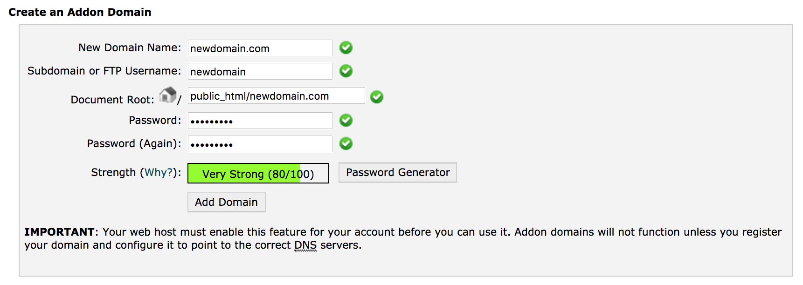
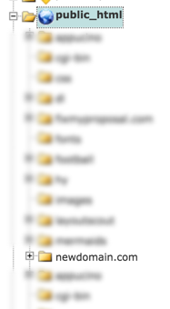

# Add second site to shared host

## Step 1 : Add the domain on your web-host's server

Log into your host's cPanel and find `Addon Domains`

Enter the domain name (with TLD). Example: `newdomain.com`

The subdirectory for the website files will automatically be created

## Step 2 : Import site files

### 2.1 — Static site

Upload site files to the new subdirectory `public_html/newdomain.com/`

### 2.2 — Wordpress site

#### New WordPress site

There are many ways to get locally developed sites up to production:

- [Direct deploy with DesktopServer](https://youtu.be/HT26gitjTHs)
- `Add more here`

#### Migrating existing site

If you are moving an existing see [Migrating Your WordPress site to a new web host](../wordpress/migrate-wordpress-install.md)

## Step 3 : Point domain to your web host's server

Log into your host's cPanel (ex: siteground) and find the name servers. Example:

`ns1.siteground340.com`
`ns2.siteground340.com`

Log into your domain registrar (ex: namecheap) and find the manage domain / name-servers section. Add the new DNS information.
