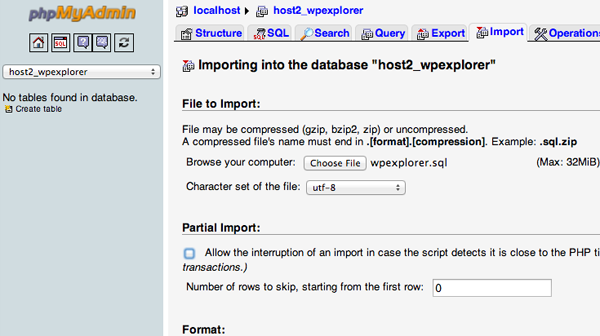

# Migrating Your WordPress site to a new web host

## Step 1: Download site's files

- Log into your host's cPanel and create a `.zip` file of your entire WordPress installation.
- Download the `.zip` to your computer via FTP (this can also serve as a backup)
- Make sure you set hidden files to visible!

## Step 2: Export database

Login to the cPanel account of your web server and open the phpMyAdmin application. Select the database that contains your WordPress installation and click on the Export tab.


Use the default settings of a `Quick export` and the `SQL` format. Click the `Go` button and the database will export to your computer.

## Step 3: Create new database new host sever

We need to create a blank database that we will import our SQL data into.

Login to cPanel and head to `MySQL Databases` application:

- Open MySQL Database and create a new database with an appropriate name for your website.
- Create a new MySQL user (with a secure password).
- Add this user account to the new database and grant it All Privileges.

**Write down the database name, the new MySQL username and its password. You will need them soon.**

## Step 4: Edit the `wp-config.php` file

FInd the `.zip` where you downloaded your site files. Open it and find the `wp-config.php` file.

_Make a copy of this file and store it in another folder on your local computer (in case we need to restore later of something goes wrong)._

Open the original file and make the following three changes:

### 1. Change The Database name

Change the `db_name` for your newly created database name:

```
define('DB_NAME', 'db_name');
```

### 2. Change The Database username

Change the `db_user` for your newly created database name:

```
define('DB_USER', 'db_user');
```

### 3. Change The Database password

Change the `db_pass` for your newly created database name:

```
define('DB_PASSWORD', 'db_pass');
```

## Step 5: Import the database



- Launch phpMyAdmin and select the Import tab.
- Click the Choose File button and select the SQL file you exported previously.
- Un-tick the Partial Import check box
- Make sure the format is set to SQL
- Click the Go button.

## Step 6: Upload WordPress file to new host

Connect to your new web host using FTP and upload the `.zip` with your site's file.

#### Primary site

If this is the primary, or only site being installed on this web server then uploading the files to the `public_html`.

#### Secondary site

If this is a secondary site, upload your files to the appropriate subdirectory: `public_html/subdomain.com`.

### Step 6.1 : Extract your files from `zip`

You can extract them directly in the cPanel's `File Manager`

## Step 7: New URL or new Domain (search & replace)

**If you are NOT changing domain name, you can skip over this step.**

Upload the [Search Replace DB](https://interconnectit.com/products/search-and-replace-for-wordpress-databases/) script to a **temp folder with a random name in the root of your WordPress installation**. Follow the directions for the script.

Change

Make sure you DELETE it when your are done (for security reasons).
